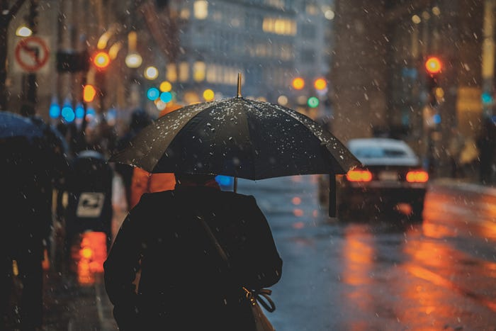
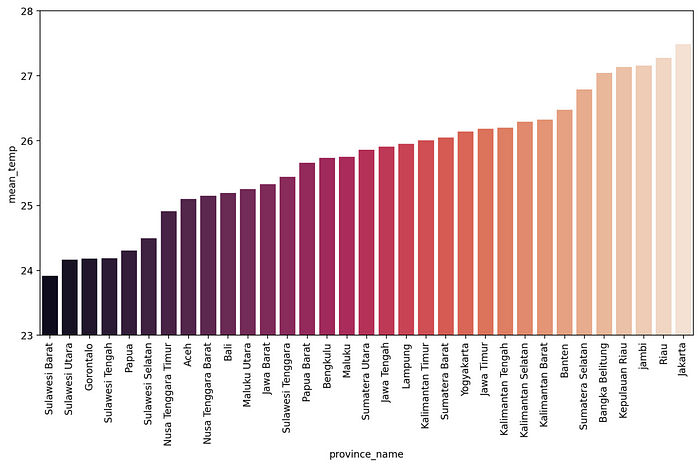
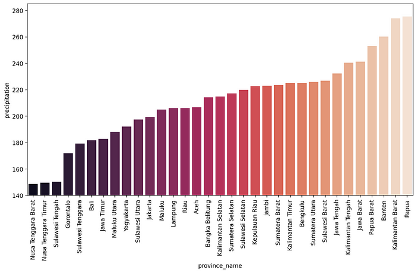
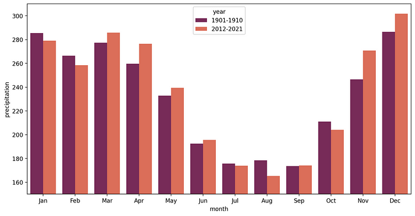
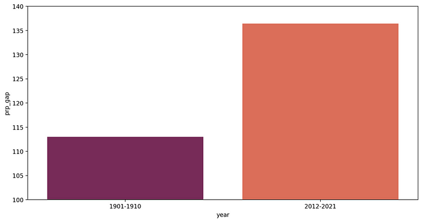
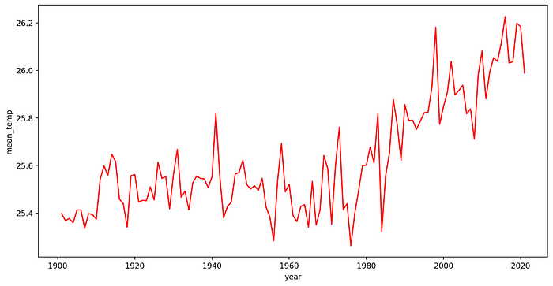
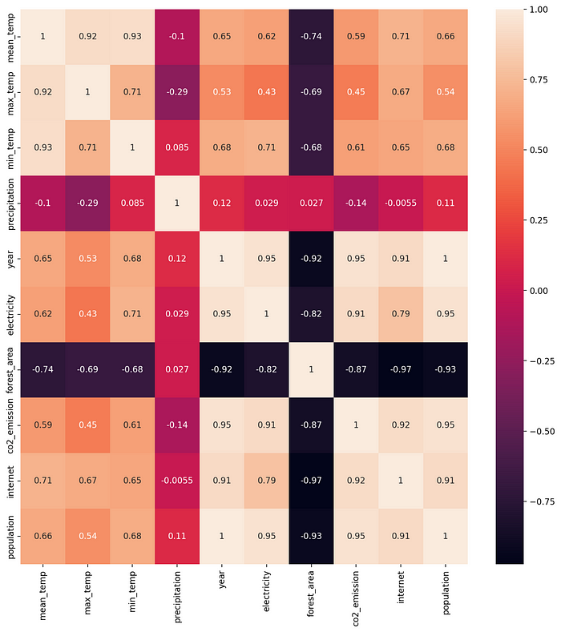

## **Background**

The dry season lasts from April to September, and the rainy season is from October to March, according to textbooks for elementary schools. However, the BMKG states that the wet season runs from November to April, and the dry season from May to October. There is difference about the time of the season between BMKG and the literature that we taught in elementary. Also we frequently get rain during the dry season, so this analysis will demonstrate how long each season lasts in Indonesia. Rainfall and climate change are intimately intertwined, thus this analysis will take climate change into account as well as explore for any intriguing connections.

# **Analysis**

## **Temperature and Precipitation (1901–2021)**

According to BMKG, the wet season occurs between November and April, leaving May through October typically dry. In Indonesia, the average monthly temperature ranges from 25 to 26 degrees Celsius all year long. The most recent climatology, 1901–2021, shows that the average monthly rainfall varies significantly. The dry season, from June to September, is when there is the least amount of rain; the average monthly rainfall in June and July is between 160 and 180 mm. While the highest rainfall occurs in December to March, between 255 and 290 mm. The hypothesis remains to be proven correct because rainfall still occurs between May and October (around 210 mm-230 mm), even though it is the dry season.

## **Region With Highest/Lowest Temperature**

Indonesia’s capital, Jakarta, has an average temperature of 27 degrees Celsius, making it the warmest region. While Sulawesi Barat, with an average temperature of 23.9 degrees Celsius, is the coldest region.

## **Region With Highest/Lowest Precipitation**

The heaviest rainfall throughout the year occurs in Papua and Kalimantan Barat, in around 275 mm. While the least region to rain is Nusa Tenggara Barat, Nusa Tenggara Timur, and Sulawesi Tengah between 148 mm and 150 mm.

## **Precipitation Comparison Between 1901–1910 and 2012–2021**

The pattern of the rainfall from the first decade (1901–1910) and the last decade (2012–2021) doesn’t have a lot of differences. The main difference that notice is the gap value between the lowest rainfall at august and heaviest rainfall at december. This leaving a question in mind. See next figure!

By subtracting the maximum value with the minimum value of each decade. The gap between the first and second decade is pretty high. Means, that in the last decade, during the dry season, it rains less and during the peak of rainfall, the heaviest the rain compared to the first decade.

## **Average Temperature from 1901–2021**

Temperature trend seems to remain constant from 1901 to 1980. Starting from 1980, the average annual temperature raising until 2021, having the highest average temperature at 2012 in 25.99 degree celsius.

## **Fun Facts — Correlation With Other Factors**

To find the correlation between temperature and precipitation, I gathered additional data related to access to electricity (% to population), forest area (% of land area), CO2 emissions (metric tons per capita), individuals using the internet (% of population), and total population. It seems that precipitation does not have any correlation with the other variables.

From doin analysis above, it can be concluded that:

1. The wet season occurs between November and April, leaving May through October typically dry. Although, rain can still be found during the dry season.
2. Highest rainfall occurs in December, while lowest rainfall happens in July.
3. Papua is the region with the highest rainfall, while Nusa Tenggara Barat is the lowest region to have rain.
4. Jakarta is the warmest region, and Sulawesi Barat is the coldest region.
5. There is a pretty high precipitation gap between 1901–19010 and 2012–2021. In the last decade, during the dry season, it rains less and during the peak of rainfall, the heaviest the rain compared to the first decade.
6. Temperature trend seems to remain constant from 1901 to 1980. Starting from 1980, the average annual temperature raising until 2021.
7. There is strong positive correlation between year and average temperature.
8. Electricity, CO2 emission, and population also have strong positive correlation to average temperature.
9. Forest area has very strong negative correlation with average temperature, while internet has very strong positive correlation with average temperature.
